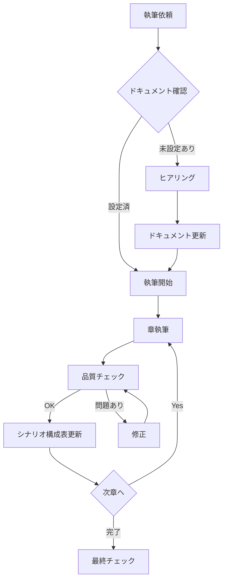

# 小説執筆プロジェクトテンプレート

AIアシスタント（Claude）と協力して小説を執筆するためのプロジェクトテンプレートです。
AIコーディングのベストプラクティスを小説執筆に転用した構成になっています。

## クイックスタート

### 1. テンプレートをコピー

```bash
cp -r novel-project-template/ my-novel-project/
cd my-novel-project/
```

### 2. Claudeに執筆を依頼

ClaudeにCLAUDE.mdを読み込ませて、執筆を開始します。
**テンプレートのままのドキュメントがある場合、Claudeが自動的にヒアリングを行います。**

### 3. ヒアリングに回答

以下の項目についてClaudeから質問されます：

- **物語の骨子**: タイトル、ジャンル、トーン、概要
- **登場人物**: 主人公や重要キャラクターの設定
- **小説展開**: 章構成、始まり〜結末の流れ
- **文体**: 視点、文体イメージ、参考作品

### 4. 執筆開始

ヒアリング結果がドキュメントに反映されたら、執筆を開始できます。

---

## ディレクトリ構成

```
novel-project-template/
├── CLAUDE.md                   # 執筆アシスタント指示書（最重要）
├── docs/
│   ├── 01_project-overview.md  # プロジェクト基本設定
│   ├── 02_worldbuilding.md     # 世界観設定
│   ├── 03_characters.md        # キャラクター設定
│   ├── 04_plot-structure.md    # シナリオ構成表 ★
│   ├── 05_style-guide.md       # 文体ガイドライン
│   ├── 06_quality-checklist.md # 品質チェックリスト
│   └── 07_terminology.md       # 用語辞典
├── manuscript/                 # 原稿
│   ├── act1/                   # 第一幕
│   ├── act2/                   # 第二幕
│   └── act3/                   # 第三幕
├── notes/
│   ├── timeline.md             # 時系列整理
│   ├── continuity-log.md       # 整合性記録
│   └── research/               # 調査メモ
└── README.md                   # このファイル
```

---

## 各ドキュメントの役割

| ドキュメント | 役割 | 更新タイミング |
|-------------|------|----------------|
| **CLAUDE.md** | AIへの指示書、ワークフロー定義 | 初期設定時 |
| **01_project-overview.md** | 作品の核心、テーマ | プロジェクト開始時 |
| **02_worldbuilding.md** | 世界のルール、設定 | 必要に応じて |
| **03_characters.md** | キャラクター詳細 | キャラ追加時 |
| **04_plot-structure.md** | シナリオ、伏線管理 ★ | 章ごとに更新 |
| **05_style-guide.md** | 文体ルール | 初期設定時 |
| **06_quality-checklist.md** | 品質確認項目 | 章完成時に使用 |
| **07_terminology.md** | 固有名詞、用語 | 新語登場時 |

★ **04_plot-structure.md** はコーディングのタスクリストに相当する最重要ドキュメントです。

---

## AIコーディングからの転用概念

| コーディング | 小説執筆 |
|-------------|---------|
| CLAUDE.md | 執筆アシスタント指示書 |
| architecture.md | 世界観設定 |
| task-list/ | シナリオ構成表 |
| coding-guidelines.md | 文体ガイドライン |
| testing-strategy.md | 品質チェックリスト |
| サブエージェント | 専門分析プロンプト |

---

## 執筆ワークフロー



---

## Tips

### 伏線管理

シナリオ構成表で以下のタグを使用：
- `【埋込】` - 伏線を埋め込む
- `【回収】` - 伏線を回収する

### 整合性チェック

CLAUDE.mdに記載された「専門分析プロンプト」を使用：
- 整合性チェッカー
- キャラクター一貫性チェッカー
- 文体レビュアー
- 伏線トラッカー

### 進捗管理

シナリオ構成表の状態フラグ：
- ⬜ 未着手
- 🔄 執筆中
- ✅ 完了

---

## ライセンス

このテンプレートは自由に使用・改変できます。
